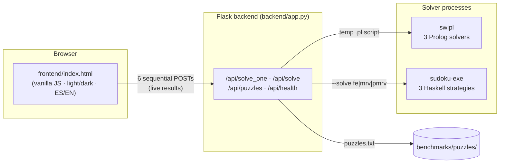

# Sudoku Comparative Study

Comparative study of **six Sudoku solvers** — three in **Prolog** and three in
**Haskell** — measuring how far declarative logic programming and pure
functional programming each get with the same problem:

| | Prolog (SWI-Prolog) | Haskell (GHC 9.6) |
|---|---|---|
| Baseline | Naive Backtracking | FirstEmpty backtracking |
| Heuristic | MRV (Minimum Remaining Values) | MostConstrained (MRV) |
| Constraint propagation | **CLP(FD)** (`all_distinct` + `labeling(ff)`) | PropagationMRV (naked/hidden singles + MRV) |

A web UI lets you enter any puzzle, run all six solvers live and compare their
times on a log-scale chart.

Originated as the final project for _Programación Lógica y Funcional_, **UNNOBA**
(2026) — **graded 10/10** — and now developed further as a personal project.
Authors: **Eric Doyle & Bruno Lodeiro**.
Made in tribute to Susana Nebuloni.

## Architecture



Each solver runs in its own OS process and reports its own internal wall-clock
time, so the measurement excludes process startup. The frontend calls solvers
**sequentially** on purpose: running six CPU-bound processes in parallel would
corrupt the timing comparison. Details in [`docs/arquitectura.md`](docs/arquitectura.md).

## Quick start (Docker — recommended)

```bash
docker build -t sudoku-study .
docker run --rm -p 5000:5000 sudoku-study
# open http://localhost:5000
```

One container with SWI-Prolog, the compiled Haskell solver and the Flask API,
which also serves the frontend. Works on any OS with Docker. This is also what
the Hugging Face **Docker Space** deployment runs (the YAML header above is its
config; GitHub just renders it as metadata).

## Running locally without Docker

Requirements: Python 3 (`pip install flask flask-cors`),
[SWI-Prolog](https://www.swi-prolog.org/) on PATH, and
[Stack](https://docs.haskellstack.org/) for the Haskell solver.

```bash
cd haskell && stack build && cd ..
python backend/app.py          # API + frontend on http://localhost:5000
python -m pytest backend/      # backend tests (no swipl/stack needed)
```

Tip: the UI supports deep links — `http://localhost:5000/?puzzle=<81 chars>&autosolve=1`
loads and solves a puzzle on open.

## Results at a glance

Median times over the 20-puzzle *easy* set (full data and figures in
[`benchmarks/results/`](benchmarks/results/), analysis in
[`docs/algoritmos.md`](docs/algoritmos.md)):

| Solver | Median (ms) |
|---|---|
| Haskell MRV | 2.9 |
| Haskell FirstEmpty | 5.1 |
| Haskell PropagationMRV | 7.1 |
| Prolog CLP(FD) | 15.2 |
| Prolog MRV | 43.4 |
| Prolog Naive BT | 326.3 |

The gap widens by orders of magnitude on hard puzzles — which is exactly what
the study sets out to measure.

## Documentation

| Document | Contents |
|---|---|
| [`docs/arquitectura.md`](docs/arquitectura.md) | System architecture, API reference, timing methodology, deployment |
| [`docs/algoritmos.md`](docs/algoritmos.md) | The six algorithms explained, complexity, measured results |
| [`prolog/README.md`](prolog/README.md) | Prolog solvers: usage, predicates, tests |
| [`haskell/README.md`](haskell/README.md) | Haskell package: build, CLI, tests |
| [`benchmarks/README.md`](benchmarks/README.md) | Benchmark runner, puzzle sets, output files |
| [`IMPROVEMENTS.md`](IMPROVEMENTS.md) | Roadmap of pending improvements |
| [`CLAUDE.md`](CLAUDE.md) | Full command reference (build, run, benchmark) |

## Project layout

```
├── prolog/src/          # 3 Prolog solvers (+ tests.pl, ejemplos.pl)
├── haskell/             # Stack package: 3 strategies, CLI, HSpec tests
├── backend/             # Flask API + pytest suite
├── frontend/            # Single-file web UI
├── benchmarks/          # Puzzle sets, comparison.py, results/
├── docs/                # Architecture & algorithm documentation
└── Dockerfile           # Single-container build of everything
```
