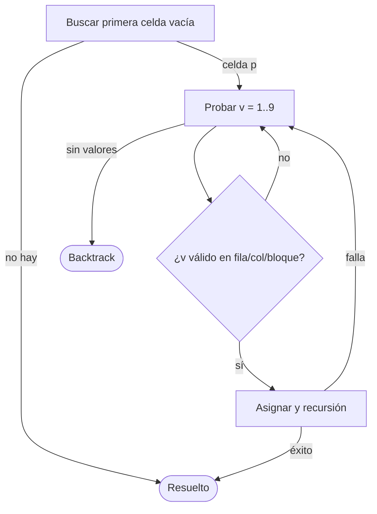
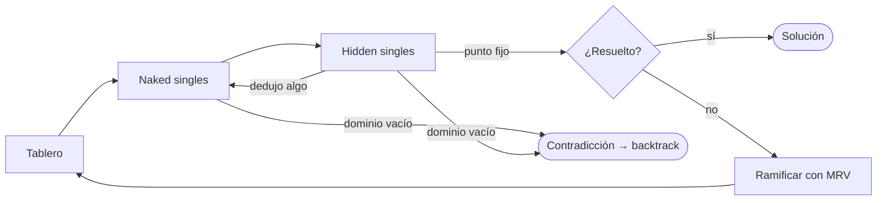

# Los seis algoritmos

Los seis solvers resuelven el mismo problema (CSP de 81 variables con dominio
1..9 y 27 restricciones *all-different*) con tres niveles de sofisticación,
implementados en ambos paradigmas para poder compararlos de a pares.

| Nivel | Prolog | Haskell | Idea central |
|---|---|---|---|
| 1 — Fuerza bruta | Naive BT (`sudoku_manual.pl`) | FirstEmpty (`Solver.hs`) | Backtracking sobre la primera celda vacía |
| 2 — Heurística | MRV (`sudoku_manual_mrv.pl`) | MostConstrained | Elegir siempre la celda con menos candidatos |
| 3 — Propagación | CLP(FD) (`sudoku_clp.pl`) | PropagationMRV | Deducir antes de adivinar |

## Nivel 1 — Backtracking ingenuo

- **Prolog**: `sudoku(+Input, -Sol)` sobre una lista plana de 81 elementos con
  `x` en las vacías. Extrae filas/columnas/bloques por aritmética de índices y
  deja que la unificación y el backtracking nativo de Prolog hagan el resto.
- **Haskell**: `findFirstEmpty` + `tryValues` recursivo sobre un `Array`
  inmutable; cada asignación crea un tablero nuevo (`board // [(pos, Filled v)]`).
- **Complejidad**: O(9^n) con n celdas vacías, sin poda. En puzzles difíciles
  puede superar el timeout de 30 s — es el baseline que hace visible el valor
  de las otras técnicas.

## Nivel 2 — Heurística MRV (Minimum Remaining Values)

La única diferencia con el nivel 1 es la **selección de variable**: en vez de
la primera celda vacía se elige la que tiene **menos candidatos posibles**.
Si una celda tiene 2 candidatos, equivocarse cuesta un subárbol de tamaño 2 y
no de tamaño 9 — la poda es dramática en la práctica aunque el peor caso siga
siendo exponencial.

- **Prolog**: `resolver(+Input, -Sol)`; calcula candidatos con `taken_in/2`
  sin unificar variables ajenas, y ordena la búsqueda por dominio mínimo.
- **Haskell**: `findMostConstrained = minimumBy (comparing numCandidates)` —
  un cambio de una línea respecto de FirstEmpty, mismo `tryValues`.
- **Costo**: cada paso escanea las celdas vacías para elegir la mejor (O(n²)
  por selección vs O(n) del nivel 1), pero el árbol que evita pagar es mucho
  mayor que ese sobrecosto.

## Nivel 3 — Propagación de restricciones

**Prolog CLP(FD)** — el enfoque declarativo puro: se declaran los dominios
(`Vs ins 1..9`) y las 27 restricciones (`all_distinct` por fila, columna y
bloque), y el motor de restricciones propaga automáticamente: cada vez que una
celda se fija, elimina ese valor de los dominios de sus 20 vecinas, en cascada.
`labeling([ff], Vs)` hace la búsqueda final eligiendo primero la variable de
dominio mínimo (first-fail, el MRV del motor). El solver completo son ~15
líneas declarativas.

**Haskell PropagationMRV** — replica a mano lo que CLP(FD) hace por motor,
para que la comparación entre paradigmas sea justa:

1. **Naked singles**: celdas con un único candidato → se fijan.
2. **Hidden singles**: valores que solo caben en una celda de una fila,
   columna o bloque → se fijan.
3. Se itera hasta **punto fijo** (ninguna técnica deduce nada nuevo); si una
   celda queda sin candidatos hay contradicción y se corta la rama.
4. Recién entonces se ramifica con MRV.

En puzzles fáciles la propagación sola resuelve casi todo (0 o pocas
ramificaciones); en difíciles reduce el árbol antes de cada decisión.

## Resultados medidos

Medianas en ms sobre los sets de 20 puzzles (`benchmarks/results/statistics.csv`,
timeout 30 s; hardware: ver condiciones en `benchmarks/README.md`):

| Solver | Fácil | Tasa de éxito (fácil) |
|---|---|---|
| Haskell MRV | 2.9 | 100 % |
| Haskell FirstEmpty | 5.1 | 100 % |
| Haskell PropagationMRV | 7.1 | 100 % |
| Prolog CLP(FD) | 15.2 | 100 % |
| Prolog MRV | 43.4 | 100 % |
| Prolog Naive BT | 326.3 | 95 % (1 timeout) |

Figuras generadas por `comparison.py` en [`../benchmarks/results/`](../benchmarks/results/):

- `fig1_bar_linear.png` / `fig2_bar_log.png` — comparación de medianas (la
  escala log es la única legible dado el rango de órdenes de magnitud)
- `fig3_boxplot.png` — dispersión por solver (la varianza de los solvers sin
  propagación crece con la dificultad)
- `fig4_heatmap_speedup.png` — speedup relativo entre pares de solvers

Lecturas principales:

1. **La jerarquía algorítmica domina al lenguaje**: en ambos paradigmas,
   propagación > MRV > naive, y la brecha crece con la dificultad.
2. **Haskell compilado corre más rápido que Prolog interpretado** a igual
   algoritmo — comparar niveles, no lenguajes sueltos.
3. **En fácil, PropagationMRV paga overhead**: la propagación cuesta más de lo
   que ahorra cuando el puzzle casi no requiere búsqueda (7.1 ms vs 2.9 ms de
   MRV pelado). En medio/difícil la relación se invierte.
4. **El costo real de CLP(FD) está en el arranque del motor**, no en el
   algoritmo: como el timing excluye el startup, sus ~15 ms son propagación
   pura — y escala mucho mejor que los manuales al subir la dificultad.

> Advertencia metodológica: una corrida por puzzle sobre wall clock. Para
> conclusiones más sólidas conviene mediana de N corridas y contar
> backtracks/nodos explorados.
