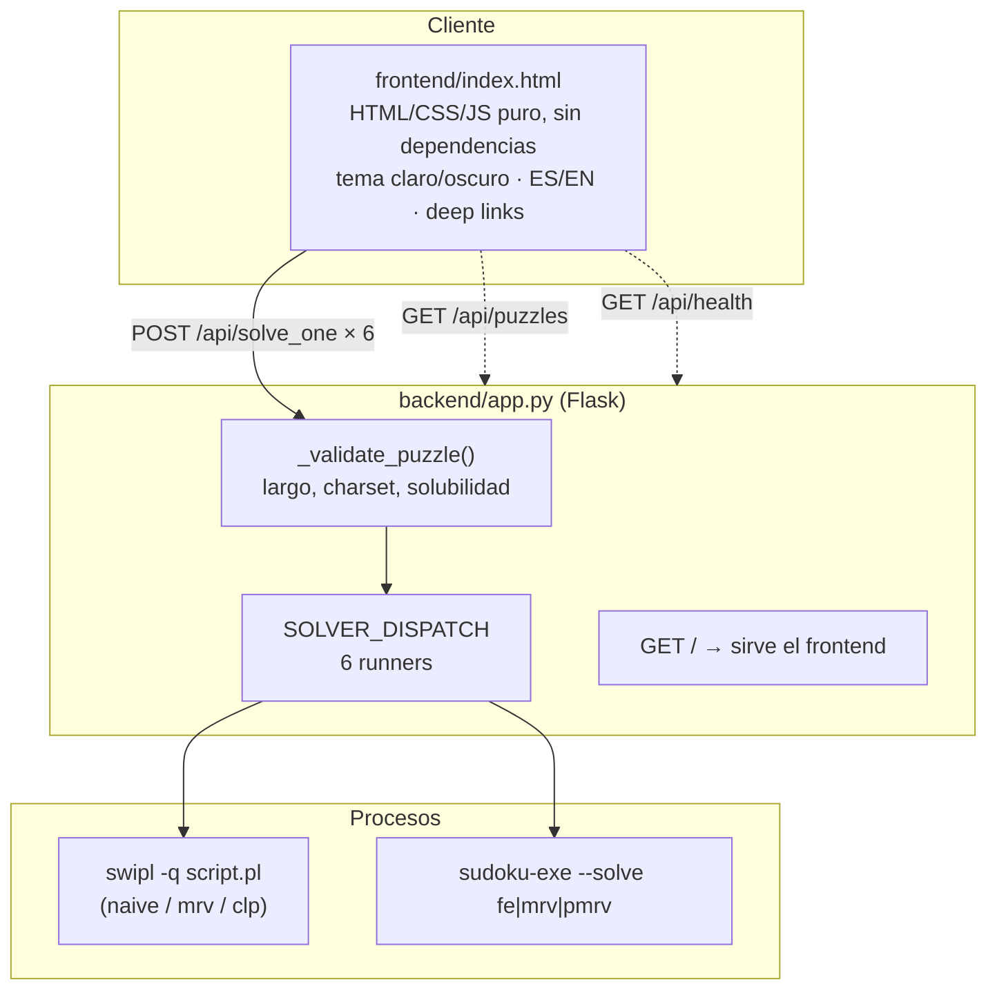
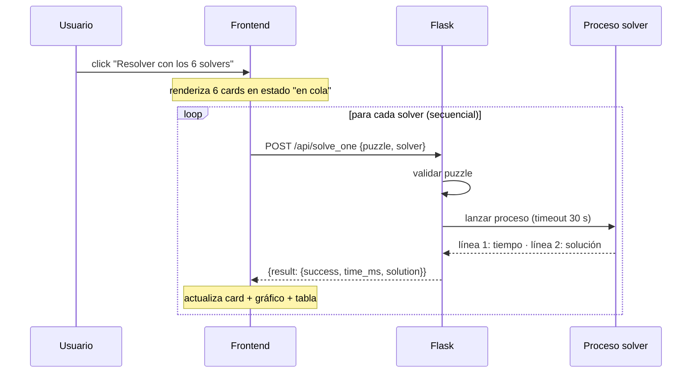
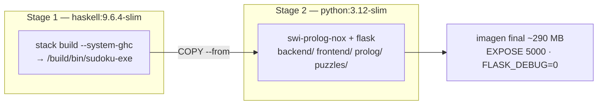

# Arquitectura del sistema

## Visión general

El sistema tiene tres capas bien separadas: una **UI web** estática, una **API
Flask** que orquesta, y los **solvers** que corren como procesos independientes.
La lógica de resolución nunca vive en el backend — Flask solo lanza procesos,
parsea su salida y la expone como JSON.



## Flujo de resolución (en vivo)

La UI pide los solvers **de a uno, en secuencia**. Esto es una decisión de
diseño, no una limitación: si los 6 procesos corrieran en paralelo competirían
por CPU y los tiempos medidos —el objeto de estudio del proyecto— quedarían
distorsionados. El "en vivo" viene de recibir una respuesta por solver.



## API

| Método | Ruta | Body / params | Respuesta |
|---|---|---|---|
| `GET` | `/` | — | El frontend (mismo origen, sin CORS) |
| `GET` | `/api/health` | — | `{swipl: bool, haskell: bool, haskell_path}` |
| `GET` | `/api/puzzles` | `?difficulty=easy\|medium\|hard` | `{puzzles: [...], count}` |
| `POST` | `/api/solve` | `{puzzle}` | Resultados de los 6 solvers (secuencial, bloqueante) |
| `POST` | `/api/solve_one` | `{puzzle, solver}` | Resultado de un solver — usado por la UI |

`solver` ∈ `prolog_naive`, `prolog_mrv`, `prolog_clp`, `haskell_fe`,
`haskell_mrv`, `haskell_pmrv`.

Formato de puzzle: **81 caracteres**, dígitos `1-9` para pistas y `0` o `.`
para celdas vacías. Validación: largo exacto, charset, y un chequeo rápido de
solubilidad en Python antes de lanzar procesos.

Resultado por solver:

```json
{ "success": true, "time_ms": 15.102, "solution": "483921657..." }
{ "success": false, "timeout": true }
{ "success": false, "no_solution": true, "time_ms": 3.1 }
{ "success": false, "error": "..." }
```

## Cómo se invoca cada solver

**Prolog** — el backend genera un script `.pl` temporal que consulta el solver
correspondiente, mide con `get_time/1`, e imprime dos líneas: tiempo en ms y la
solución como 81 dígitos (o `NO_SOLUTION`). Se ejecuta con `swipl -q`.

**Haskell** — `sudoku-exe --solve <fe|mrv|pmrv> <puzzle81>` imprime el tiempo en
segundos y la solución. El binario se busca en `.stack-work/`, `dist-newstyle/`,
el PATH y `%APPDATA%\local\bin` (en ese orden).

## Metodología de timing

El tiempo se mide **dentro del proceso del solver**, alrededor de la llamada de
resolución únicamente — excluye el arranque del proceso, el parsing y la I/O:

| Lenguaje | Reloj | Por qué |
|---|---|---|
| Prolog | `get_time/1` (wall clock) | En Windows usa `QueryPerformanceCounter` (~100 ns). `statistics(cputime)` se descartó: resolución de 15.625 ms en Windows |
| Haskell | `System.Clock.getTime Monotonic` | Mismo motivo; `getCPUTime` tiene la misma limitación |

Consecuencia: los tiempos comparan **algoritmos**, no incluyen el costo de
levantar SWI-Prolog (~200 ms) ni el binario Haskell. Por eso un puzzle "fácil"
responde en la UI en ~1-2 s aunque los tiempos reportados sean de milisegundos.

## Despliegue



- **Local**: `docker build -t sudoku-study . && docker run --rm -p 5000:5000 sudoku-study`
- **Hugging Face Spaces**: el frontmatter YAML de `README.md` (`sdk: docker`,
  `app_port: 5000`) configura un Docker Space; basta pushear el repo al Space.
- Variables: `PORT` (default 5000), `FLASK_DEBUG` (`0` en Docker; el debugger de
  Werkzeug nunca debe quedar expuesto públicamente).

## Tests

- `backend/test_app.py` (pytest): validación, dispatch con solvers falsos
  (monkeypatch) y regresión de `/api/solve`. No requiere swipl ni stack.
- `haskell/test/Spec.hs` (HSpec): propiedades del solver funcional (`stack test`).
- `prolog/src/tests.pl`: suite de casos para los solvers lógicos.
